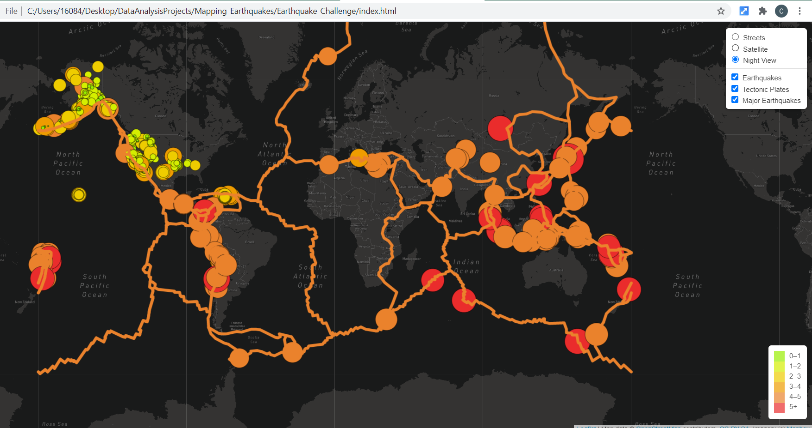
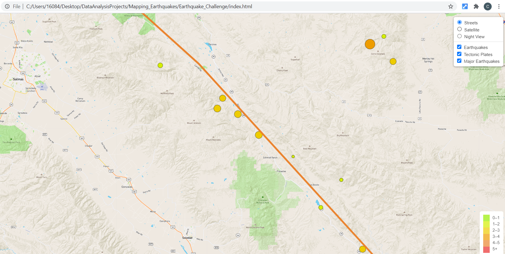

# Mapping Weekly Earthquakes

The purpose of this project is to visually show the differences between the magnitudes of earthquakes all over the world for the last seven days.  Using Javascript libraries, D3,
Leaflet and MapBox, and an API call to USGS for up-to-date data, a tiled map can be viewed toggling layers on and off that display major magnitude earthquakes, tectonic plates and
all earthquakes of any magnitude.  Furthermore, each layer or combination of layers can be viewed on 3 different maps; street view, satellite view and night view.  Using different
views while looking at specific data can give a big picture view or a closer look at populated areas at the street level.

## Resources
JavaScript (D3, Leaflet and MapBox libraries), GeoJSON from USGS API, MapBox API, HTML, CSS, VS Code

## Results

Three pngs are provided as an example of the different views and what can be concluded by mapping out the data.

1. Night View / All Data

  Orange lines indicate the tectonic plates.  The dots representing earthquakes are scaled to indicate the severity of the earthquake with the larger orange and red dots
  representing the earthquakes equal to or larger than 4.5 ML (or more commonly, Richter scale).
  
  

  
  
2.  Street View / All Data  

  Again orange lines indicate a tectonic plate, and as above, it is true that earthquakes are most common along tectonic plates.  In this view, we can see the nearest cities of
  Salinas, Gonzales and Soledad in California.  We can also see some major national highways along the tectonic plate and where some major earthquakes occur.
  
  

  
  
3. Satellite View / All Data

     

  
